# Detección automática de niveles de propensión a la violencia contra la mujer analizando expresiones escritas con técnicas de Natural Language Processing y Machine Learning

## [Tesis de Pregrado - Universidad ESAN, Lima, Perú, 2020]
#### Ingeniería en Tecnologías de la Información y Sistemas
#### Tereza Yallico Arias, Neisser Ale Ale & Junior Fabián Arteaga

En Perú, 7 de cada 10 mujeres han pasado por violencia contra la mujer en algún momento de su vida. La más común es la Violencia Psicológica, que es también la más difícil de detectar, pues no deja huellas visibles, pero avanza hacia comportamientos más peligrosos a través del concepto psicológico del Ciclo de Violencia, que hace que la víctima normalice ese comportamiento y solo se romperá cuando sea  consciente del riesgo que corre en esa relación y tome acción al respecto. Darle ese aviso es el objetivo del modelo de Machine Learning desarrollado, pues analizando las expresiones virtuales escritas de su pareja clasifica su nivel de propensión a la violencia en 5 niveles (Bajo riesgo, Chantaje emocional, Celos, Humillaciones/Insultos, Amenazas/Posesividad)  llamando a la toma de acción oportuna. Para ello, se recolectaron 5250 registros que fueron etiquetados en los 5 niveles, teniendo 5 fuentes de datos: Twitter, Webs de apoyo psicológico, Registro de casos de la Línea 100, Videos Relacionados y Narraciones de potenciales víctimas; estos fueron preprocesados con técnicas de Natural Language Processing. Tras 396 experimentos, se obtuvieron los mejores resultados con la combinación de TF-IDF y los modelos de Machine Learning Naive Bayes y Support Vector Machine, con un 0.9266 y 0.9215 de Accuracy, respectivamente.

Keywords: Natural Language Processing, Machine Learning, Violencia contra la mujer, Violencia psicológica, Violencia de Pareja, Análisis de mensajes virtuales, Niveles de Violencia.

En este repositorio se ha cargado la data (solo la parte pública, por acuerdos de confidencialidad) utilizada para el entrenamiento del modelo clasificador de niveles de propensión a la violencia contra la mujer.

### Cuál es el problema?

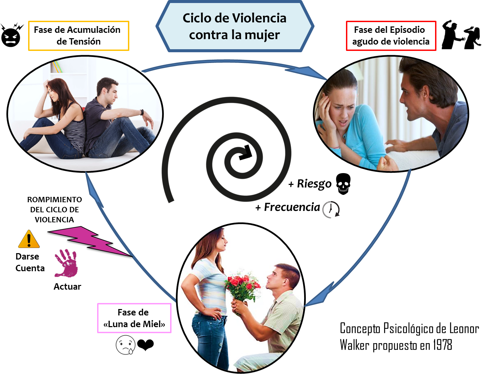

El Ciclo de la Violencia contra la mujer tiene tres fases: La primera es la **Acumulación de Tensión** hay discusiones,descontento, él tiene repentinos cambios de humor e intenta hacer (de una forma no amable) "que ella haga lo que debe", ella ajusta su comportamiento para "evitar  peleas", excusandolo por "haber tenido un mal día", atribuyendolo a su personalidad o hasta culpándose a ella misma.  

Sin embargo llegan a la segunda fase, la más traumática, el **Episodio Agudo de Violencia**, aquí él explota, la insulta, la humilla, la amenaza, incluso puede llegar a golpearla. Para el agresor "ella ha recibido lo que merecía". Aquí ella intentará alejarse de él (es lo más natural), sin embargo es la fase 3 la que hace que sigan "dando vueltas" en este "círculo vicioso". 

En la **Fase de "Luna de Miel"**, para evitar que ella lo deje, él le rogará su perdón, le jurará que él va a cambiar, que nunca pasará de nuevo, que lo que pasó fue algo aislado. Se portará como al comienzo de la relación con palabras bonitas y detalles, hará TODO lo necesario para que ella lo perdone y acepte quedarse con él. Lamentablemente esta fase no dura mucho y si ella acepta volver a una relación así sin buscar ayuda por el comportamiento de él, lo más probable es que empiecen a dar vueltas en el ciclo una y otra vez, acumulando tensión,explotando y volviendo a dar otra vuelta. 

Lo peligroso de  dichas vueltas es que si una permanece iterando en el ciclo estos se vuelven cada vez más peligrosos (pasa del tipo de violencia psicológica a la física y/o sexual) y más cortos/frecuentes (si antes tomaba meses dar una vuelta completa, con el tiempo hasta se pueden dar varias vueltas en un día). Lo peor es que la víctima va *normalizando este comportamiento*, o hasta culpándose por él y seguirá modificando su comportamiento o excusándolo pues *niega estar en una situación de riesgo*, niega que le esté pasando a ella, porque es "algo que le pasa a todas las parejas", porque "los hombres son así" (estereotipos de género), por qué él le jura que no va a volver a pasar...

Solo hay una manera de salir del Ciclo de Violencia contra la mujer, y consta de dos pasos:
1. Darse cuenta de la situación de peligro que una corre
2. Tomar acción (buscar ayuda psicológica, apoyo legal, ponerse a salvo a una y a sus hijos)

Hasta que no sea conciente del riesgo que corre, la víctima lo seguirá negando y avanzará en dar vueltas en el ciclo de la violencia. Y no se trata solo de darse cuenta, sino también ser consciente del nivel de riesgo que se corre en esa relación, de qué tan lejos ya ha ido. El primer tipo de violencia en manifestarse es la psicológica, pero ¿Cómo podemos medir el nivel de violencia contra la mujer si la violencia psicológica no es visible? o sí? Acaso no son los mensajes virtuales un buen indicador de lo que piensa y siente su pareja hacia ella? Habrá un patrón reconocible por un algoritmo de Machine Learning?

Veamos...con ayuda de una de las psicólogas del Centro de Emergencia Mujer (Programa Nacional Contra la Violencia Familiar y Sexual, Perú) identificamos y validamos niveles de que un chico sea propenso a ser violento contra la mujer en base a lo que le escribe a su pareja. Observemos cada nivel y si se le puede reconocer en los mensajes. Nótese que a medida que los niveles van subiendo, el riesgo de ella en esa relación también.

#### NIVEL 1: CHANTAJE EMOCIONAL

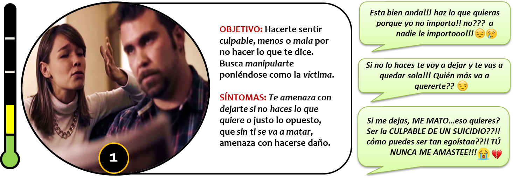

#### NIVEL 2: CELOS

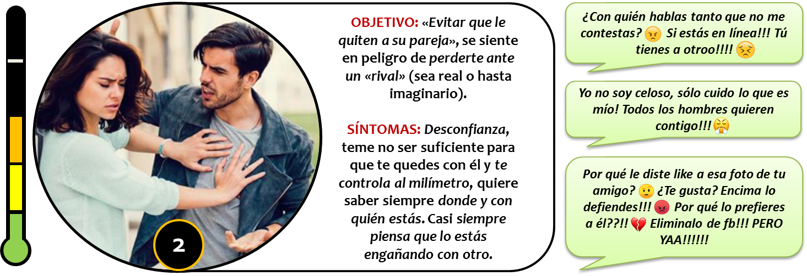

#### NIVEL 3: INSULTOS/HUMILLACIONES

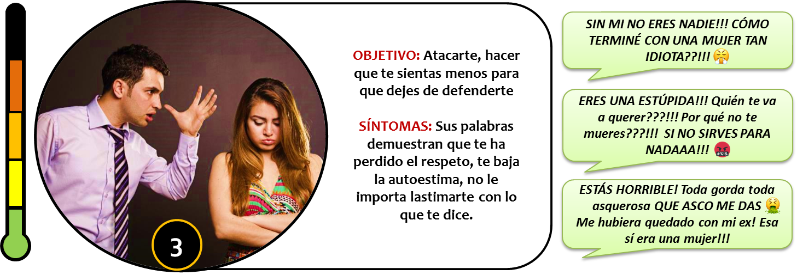

#### NIVEL 4: AMENAZAS/POSESIVIDAD

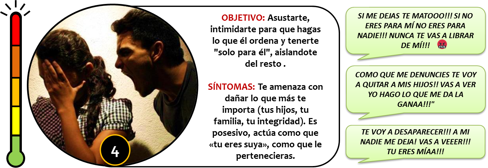

Los niveles están planteados para clasificar el avance de la violencia psicológica, como PREVENCIÓN, pues desde aquí se pasará a la violencia Física/Sexual, ya con consecuencias mucho más graves que incluso desembocan en feminicidios.
Durante mucho tiempo el Machine Learning ha permitido clasificar/predecir con mucha certeza en tópicos como diagnóstico de cáncer en base a imágenes, proyecciones de precios en base a históricos, análisis de sentimientos para evaluar la satisfacción del cliente en base a sus comentarios. Sin embargo, raras veces se le ha utilizado para prevenir la Violencia contra la mujer. Ese es el objetivo de este algoritmo. Detectar a tiempo, para actuar a tiempo. 

Entonces...la pregunta es: ¿Podemos entrenar un algoritmo que ayude a identificar niveles de propensión a la violencia contra la mujer (en su fase inicial, la psicológica) analizando los mensajes virtuales (chats) de su pareja para que le dé aviso a la usuaria del riesgo que corre en esa relación? 

### El Algoritmo...

A continuación se visualiza el diagrama de para la elaboración del algoritmo según las 5 etapas del desarrollo de un modelo de Machine Learning, en la *Recolección de Datos* se expondrán las fuentes de datos y cuántos registros fueron extraídos de cada una. En el *Preprocesamiento* se identificará cada una de las técnicas (manuales y automáticas) que se le aplicó al texto base para "limpiarlo".
En la fase de *Extracción de características* se exponen las técnicas a utilizar para representar el texto de los mensajes virtuales como vectores numéricos, donde se puedan probar algoritmos para clasificarlos en niveles. En la fase de *Modelado* se probarán distintos algoritmos para lograr la clasificación de la forma más certera, siendo esta medida en la fase de *Evaluación del modelo*. 

## Etapas de desarrollo del modelo:

### 1. Recolección de datos

El principal impedimento para desarrollar un algoritmo de Machine Learning que aborde esta problemática es la falta de data estructurada y etiquetada. No hay estudios previos, ni siquiera exploratorios, que busquen identificar automáticamente la violencia psicológica contra la mujer en las expresiones escritas que le dirige su pareja por vía virtual. Por tanto fue necesario construir una base de datos (debido a lo difícil de conseguir de estas muestras, pues son consideradas un tanto personales y no son compartidas con tanta frecuencia por sus dueñas  por miedo a represalias de su agresor, verguenza de ser señaladas como víctimas, etc) y de varias fuentes al ser escasas. Se tuvieron 5 fuentes principales, cada una con su propia dificultad de extracción, de las cuales se obtuvieron 797037 documentos de texto para la creación del corpus (conjunto de palabras entrenadas para ser reconocidas y consideradas en el análisis) de los que 5250 fueron posteriormente usados para el entrenamiento y prueba del algoritmo clasificador tras ser etiquetados en alguna de las 5 categorías.

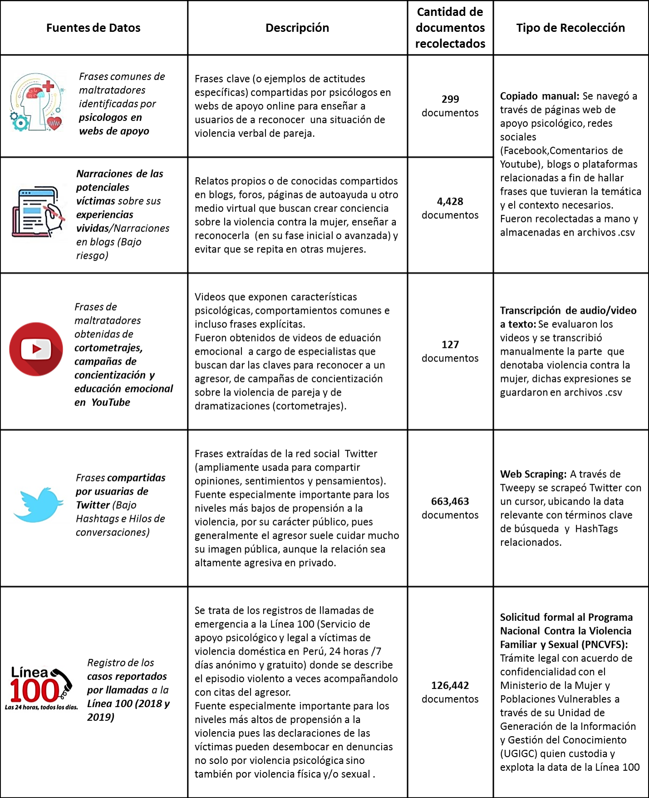

El corpus ha de contener las palabras consideradas en todo el análisis y además "aprender" las relaciones entre ellas (sinonimia, antonimia, contextos, etc) por ello debe entrenarse con la mayor cantidad de data (de preferencia relacionada con el contexto de la conversación de pareja) y eso incluye el texto que será posteriormente etiquetado. La muestra etiquetada también se origina de varias fuentes para mantener la variedad y representatividad de estas en el análisis.

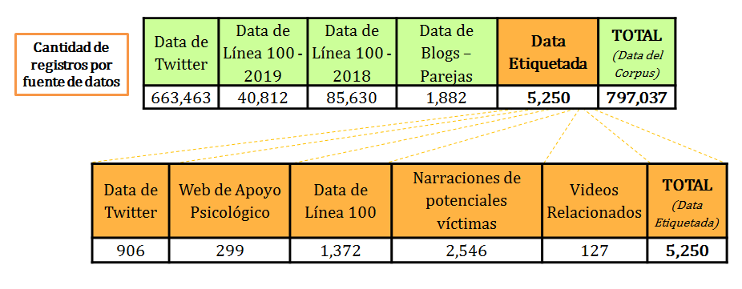

### 2. Preprocesamiento

### Proceso Manual

#### - Etiquetado (en 5 niveles)
  El etiquetado de 5250 expresiones escritas en uno de los 5 niveles de propensión a la violencia contra la mujer (0: BAJO RIESGO, 1: CHANTAJE_EMOCIONAL, 2: CELOS_JUSTIFICACION, 3: INSULTOS_HUMILLACIONES, 4: AMENAZAS_POSESIVIDAD) se dió analizando bajo los criterios teóricos una a una. El preetiquetado fue realizado por la entonces tesista Tereza Yallico y posteriormente evaluadas (también una a una) y , en ocasiones, corregidas por la  Psicóloga Gabriela Llanto, que entonces laboraba en el CEM (Centro de Emergencia Mujer) de Apolo, en Lima (Perú), cuyo rol principal es dar contención emocional a las víctimas de violencia doméstica y evaluar su nivel de riesgo respecto a la situación en la que estaban (evaluado a través de preguntas cerradas y el relato de las agresiones tanto psicológicas como físicas que estas sufrieron).

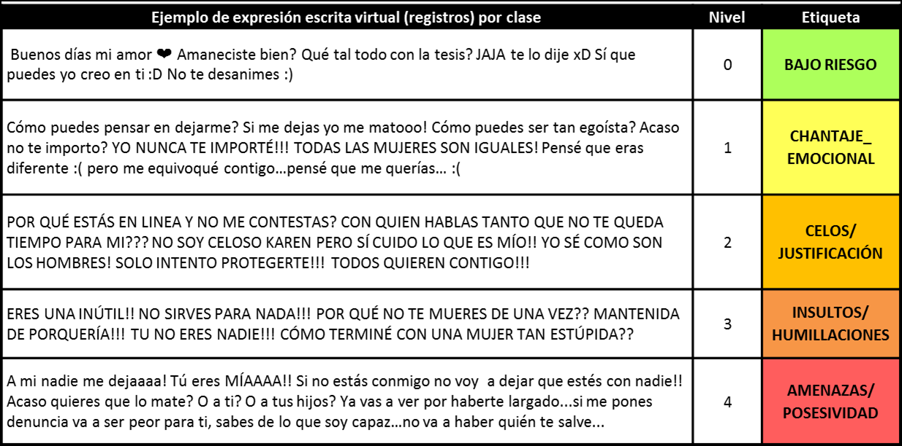

 #### - Cambio de tiempo verbal 
  Es necesario que las expresiones escritas tengan la misma forma en que las formularía el agresor a la víctima. Debido a que varias de las muestras incialmente estaban en la forma de relatos, a estas se les cambió el tiempo verbal una a una manualmente (a las que fue necesario, algunas ya lo tenían) a fin de que el algortimo entrene con la forma correcta de las oraciones, se respetó el contenido y las expresiones tal y como fueron formuladas, solo se les cambió la forma emulando la intención al ser dichas y teniendo en cuenta el contexto en que se formularon incialmente. Este proceso se realizó a las expresiones escritas que sí fueron etiquetadas. Tal como se muestra en la siguiente figura.

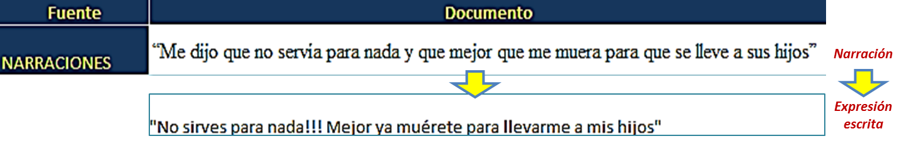

### Proceso Automático

El preproceso automático fue aplicado a todo el corpus y a la data etiquetada, toda la programación fue en Python, se realizó con funciones propias y también de librerías ya existentes. A continuación se expondrá paso a paso del preprocesamiento y cómo se logró:

#### a) Remoción de Links

  Debido a que parte de la data (en especial la del corpus) provenía de Twitter y fue obtenida con técnicas de scraping, contenía links y, dado que estos no aportan información valiosa al análisis, fueron eliminados con ayuda del paquete Re, que detecta patrones específicos (Links, Hashtags, menciones, etc).
  
  
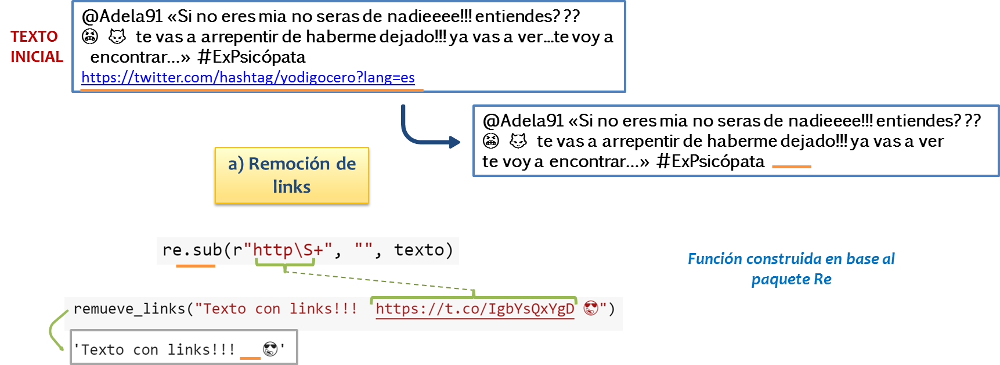

#### b) Reemplazo de emoticones

  Los emoticones emulan gestos a través de combinaciones de signos de puntuación, sí aportan información valiosa sobre la intención y emoción expresada, por tanto y para no perder el valor predictivo, los que expresaban sentimientos significativos para el análisis fueron reemplazados por palabras clave.

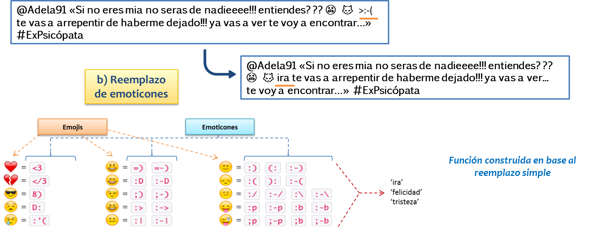

#### c) Remoción de Hashtags y menciones

  Al igual que con los links, estos datos solo distorsionarían el análisis y tomando en cuenta las fuentes de la base de datos, fue necesario retirarlos con ayuda del paquete Re, identificando el patrón y removiendolos.

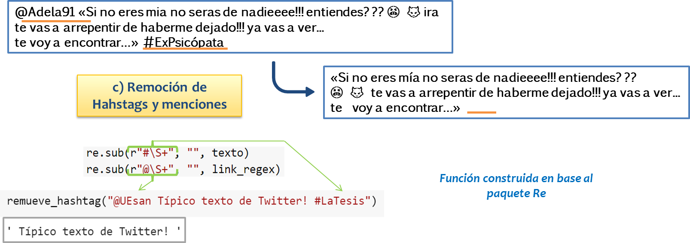

#### d) Reemplazo de emojis

  Los emojis también son ampliamente usados especialmente en redes sociales para expresar sentimientos que sí aportan valor predictivo. Se les reemplazó por palabras clave y fueron entrenados en el corpus tal como las demás palabras a fin de que sí colaboren en el análisis. 

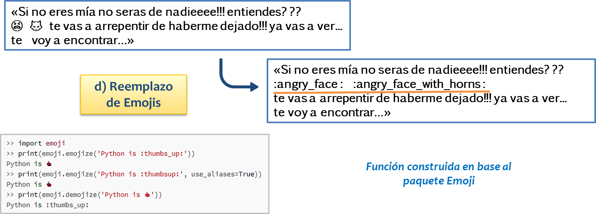

#### e) Eliminación de signos y números

  Es cierto que los signos aportan intensidad, sin embargo en la comunicación virtual en español (especialmente en Latinoamérica) hay una gran gama de variaciones donde se les utilizaría para muchas intenciones, tanto intensa alegría como intensa ira, dudas, afirmaciones efusivas, reclamos y declaraciones fuertes, dada la enorme probabilidad de que haga distrosión estando tan presente en los niveles bajos como en los altos se decidió excluirlos del análisis. Para lo cual se utilizaron funciones del paquete Re, se hizo lo mismo con los número pues estos no aportaban valor predictivo. 

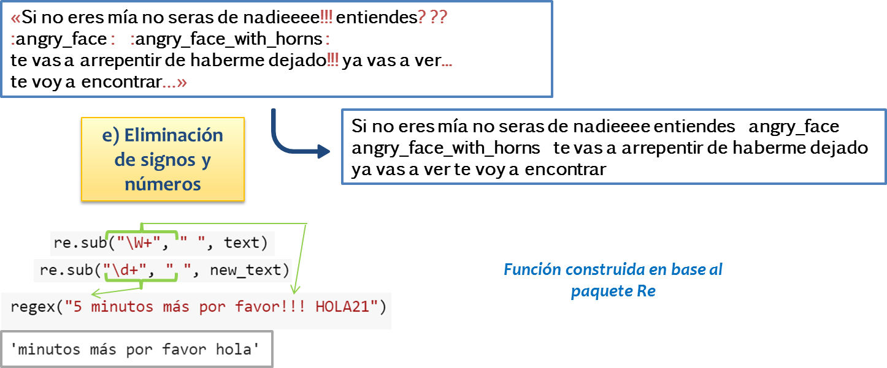

#### f) Remoción de tildes y caracteres idiomáticos

Dado el caracter instantáneo y descuidado ortográficamente hablando de la comunicación virtual, si se escribiera una palabra con tildes y en otra ocasión sin tildes o con ellas pero en un lugar incorrecto, se tomarían como palabras distintas, con distinto significado e incluso contexto, esto crearía distorsión pues la única diferencia sería la correcta/incorrecta puntuación cuando se trata de la misma palabra. Para corregir esto, se eliminan todas las tildes y los caracteres idiomáticos (diéresis, eñes, etc). Esto se logra a través del paquete Unidecode.

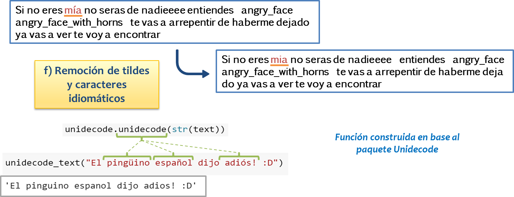

#### g) Homologación de entusiasmo y minusculización

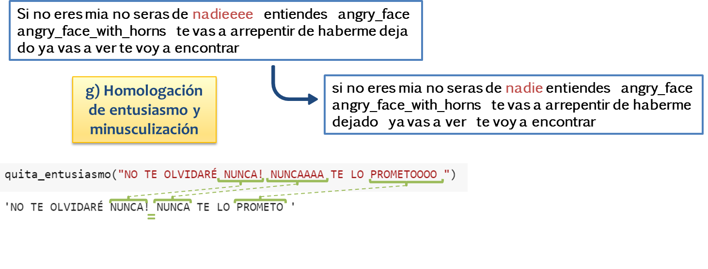
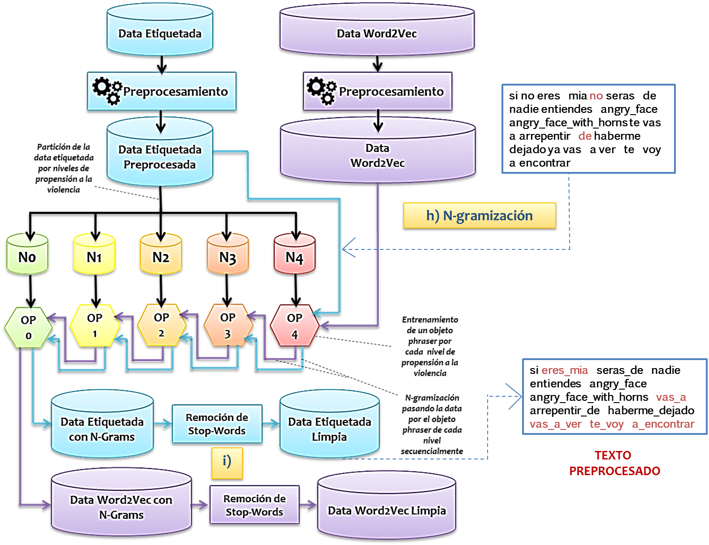
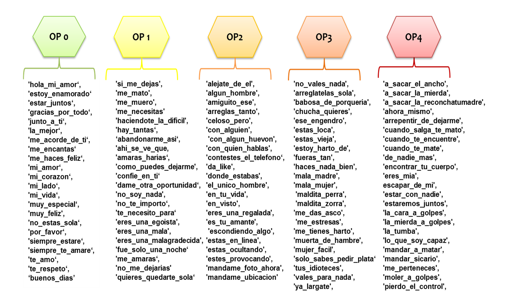
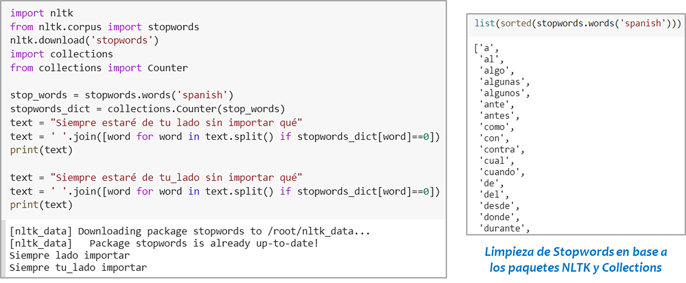

### 3. Extracción de Características

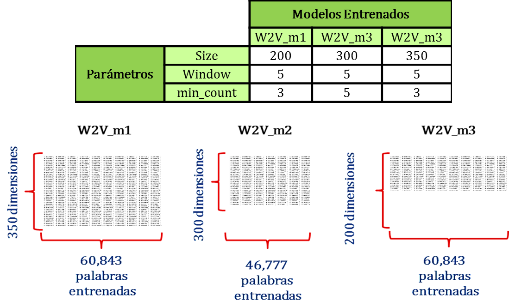

### 4. Modelado

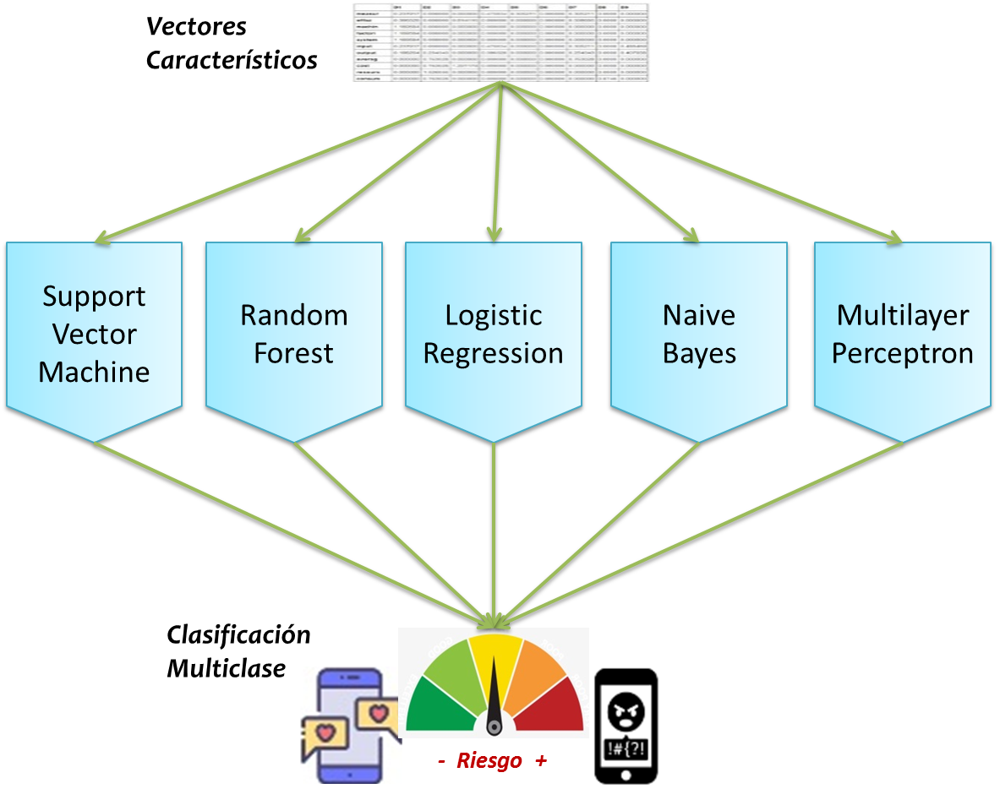

### 5. Evaluación del modelo
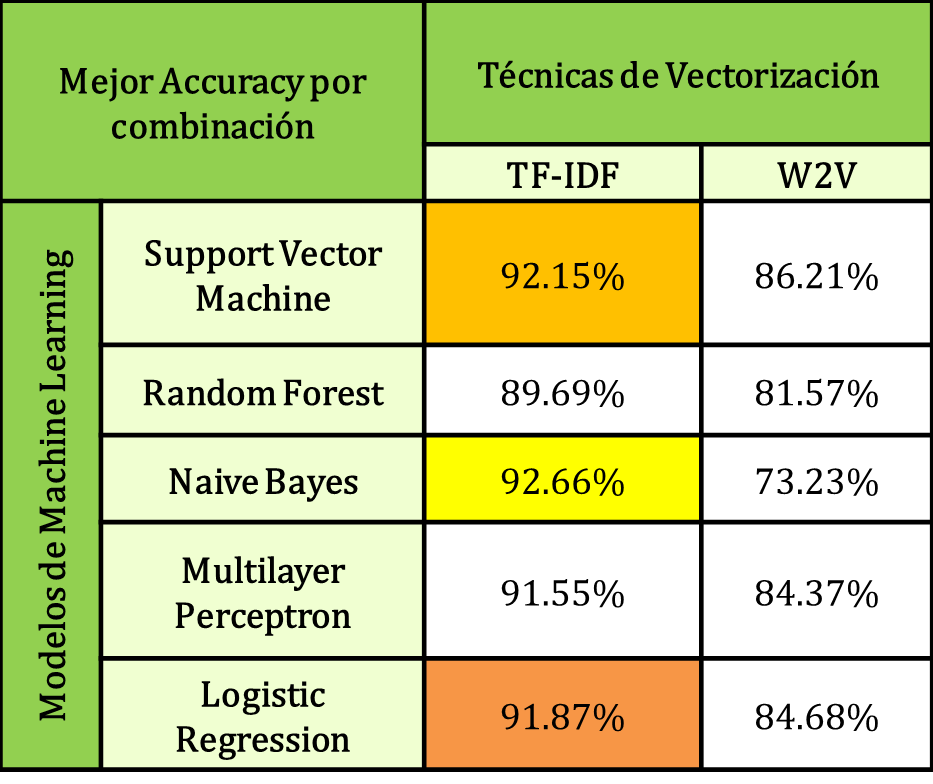
