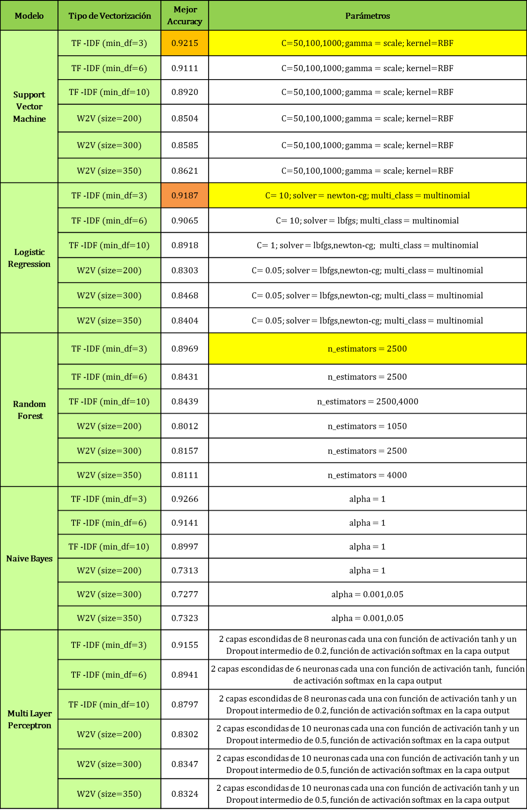

# Detección automática de niveles de propensión a la violencia contra la mujer analizando expresiones escritas con técnicas de Natural Language Processing y Machine Learning

## [Tesis de Pregrado - Universidad ESAN, Lima, Perú, 2020]
#### Ingeniería en Tecnologías de la Información y Sistemas
#### Tereza Yallico Arias (Tesista) & Junior Fabián Arteaga (Asesor)

  En Perú, 7 de cada 10 mujeres han pasado por violencia contra la mujer en algún momento de su vida. La más común es la Violencia Psicológica, que es también la más difícil de detectar, pues no deja huellas visibles, pero avanza hacia comportamientos más peligrosos a través del concepto psicológico del Ciclo de Violencia, que hace que la víctima normalice ese comportamiento y solo se romperá cuando sea  consciente del riesgo que corre en esa relación y tome acción al respecto. Darle ese aviso es el objetivo del modelo de Machine Learning desarrollado, pues analizando las expresiones virtuales escritas de su pareja clasifica su nivel de propensión a la violencia en 5 niveles (Bajo riesgo, Chantaje emocional, Celos, Humillaciones/Insultos, Amenazas/Posesividad)  llamando a la toma de acción oportuna. Para ello, se recolectaron 5250 registros que fueron etiquetados en los 5 niveles, teniendo 5 fuentes de datos: Twitter, Webs de apoyo psicológico, Registro de casos de la Línea 100, Videos Relacionados y Narraciones de potenciales víctimas; estos fueron preprocesados con técnicas de Natural Language Processing. Tras 396 experimentos, se obtuvieron los mejores resultados con la combinación de TF-IDF y los modelos de Machine Learning Naive Bayes y Support Vector Machine, con un 0.9266 y 0.9215 de Accuracy, respectivamente.

**Keywords: Natural Language Processing, Machine Learning, Violencia contra la mujer, Violencia psicológica, Violencia de Pareja, Análisis de mensajes virtuales, Niveles de Violencia.**

  En este repositorio se ha cargado la data (solo la parte pública, por acuerdos de confidencialidad) utilizada para el entrenamiento del modelo clasificador de niveles de propensión a la violencia contra la mujer a fin de fomentar la investigación que contribuya a la prevención de la Violencia contra la Mujer.

### ¿Cuál es el problema?

  

  El Ciclo de la Violencia contra la mujer tiene tres fases: La primera es la **Acumulación de Tensión** hay discusiones,descontento, él tiene repentinos cambios de humor e intenta hacer (de una forma no amable) "que ella haga lo que debe", ella ajusta su comportamiento para "evitar  peleas", excusandolo por "haber tenido un mal día", atribuyendolo a su personalidad o hasta culpándose a ella misma.  

  Sin embargo llegan a la segunda fase, la más traumática, el **Episodio Agudo de Violencia**, aquí él explota, la insulta, la humilla, la amenaza, incluso puede llegar a golpearla. Para el agresor "ella ha recibido lo que merecía". Aquí ella intentará alejarse de él (es lo más natural), sin embargo es la fase 3 la que hace que sigan "dando vueltas" en este "círculo vicioso". 

  En la **Fase de "Luna de Miel"**, para evitar que ella lo deje, él le rogará su perdón, le jurará que él va a cambiar, que nunca pasará de nuevo, que lo que pasó fue algo aislado. Se portará como al comienzo de la relación con palabras bonitas y detalles, hará TODO lo necesario para que ella lo perdone y acepte quedarse con él. Lamentablemente esta fase no dura mucho y si ella acepta volver a una relación así sin buscar ayuda por el comportamiento de él, lo más probable es que empiecen a dar vueltas en el ciclo una y otra vez, acumulando tensión,explotando y volviendo a dar otra vuelta. 

  Lo peligroso de  dichas vueltas es que *si una permanece iterando en el ciclo estos se vuelven cada vez más peligrosos* (pasa del tipo de violencia psicológica a la física y/o sexual) y más cortos/frecuentes (si antes tomaba meses dar una vuelta completa, con el tiempo hasta se pueden dar varias vueltas en un día). Lo peor es que la víctima va *normalizando este comportamiento*, o hasta culpándose por él y seguirá modificando su comportamiento o excusándolo pues *niega estar en una situación de riesgo*, niega que le esté pasando a ella, porque es "algo que le pasa a todas las parejas", porque "los hombres son así" (estereotipos de género), por qué él le jura que no va a volver a pasar, la verdad es que hay muchos motivos por los que la víctima lo normaliza, sin embargo, se pone en riego a sí misma (y a sus hijos si los hubiera) si continúa dando vueltas en el Ciclo de Violencia

**Entonces...¿Existe manera de salir del Ciclo de Violencia contra la mujer? SÍ, consta de dos pasos**

   1. Darse cuenta de la situación de peligro que una corre
  
   2. Tomar acción (buscar ayuda psicológica, apoyo legal, ponerse a salvo a una y a sus hijos)

  Hasta que no sea *consciente del riesgo que corre*, la víctima lo seguirá *negando* y avanzará en dar vueltas en el ciclo de la violencia. Y no se trata solo de darse cuenta, sino también *ser consciente del nivel de riesgo que se corre en esa relación, de qué tan lejos ya ha ido*. El primer tipo de violencia en manifestarse es la psicológica, pero ¿Cómo podemos medir el nivel de violencia contra la mujer si la violencia psicológica no es visible? ¿o es que sí podemos detectarla de alguna manera *no tradicional*? ¿Acaso no son los mensajes virtuales un buen *indicador de lo que piensa y siente su pareja hacia ella*? ¿Habrá un *patrón* reconocible por un algoritmo de Machine Learning?

  Veamos...con ayuda de una de las psicólogas del Centro de Emergencia Mujer (Programa Nacional Contra la Violencia Familiar y Sexual, Perú) identificamos y validamos niveles de que un chico sea propenso a ser violento contra la mujer en base a lo que le escribe a su pareja. Observemos cada nivel y si se le puede reconocer en los mensajes. Nótese que a medida que los niveles van subiendo, el riesgo de ella en esa relación también y generalmente para llegar ahí ha dado más vueltas en el Ciclo de Violencia. 

### NIVELES DE PROPENSIÓN A LA VIOLENCIA CONTRA LA MUJER

#### NIVEL 1: CHANTAJE EMOCIONAL

_________________________________________________________________________________________________________________________________________________________

#### NIVEL 2: CELOS

_________________________________________________________________________________________________________________________________________________________

#### NIVEL 3: INSULTOS/HUMILLACIONES

_________________________________________________________________________________________________________________________________________________________

#### NIVEL 4: AMENAZAS/POSESIVIDAD

_________________________________________________________________________________________________________________________________________________________

 Los niveles están planteados para clasificar el avance de la violencia psicológica, como PREVENCIÓN, pues desde aquí se pasará a la violencia Física/Sexual, ya con consecuencias mucho más graves que incluso desembocan en feminicidios.

 Durante mucho tiempo el Machine Learning ha permitido clasificar/predecir con mucha certeza en tópicos como diagnóstico de cáncer en base a imágenes, proyecciones de precios en base a históricos, análisis de sentimientos para evaluar la satisfacción del cliente en base a sus comentarios. Sin embargo, raras veces se le ha utilizado para prevenir la Violencia contra la mujer. Ese es el objetivo de este algoritmo. *Detectar a tiempo, para actuar a tiempo* 

 Sería necesario entonces ayudar a la víctima a darse cuenta en qué nivel de violencia se encuentra tomando esa decisión  a fin de que ella tome acción oportuna y pueda salir del Ciclo de Violencia. 
*Entonces...la pregunta es: ¿Podemos entrenar un algoritmo que ayude a identificar niveles de propensión a la violencia contra la mujer (en su fase inicial, la psicológica) analizando los mensajes virtuales (chats) de su pareja para que le dé aviso a la usuaria del riesgo que corre en esa relación? **

### El Algoritmo...

  A continuación se visualiza el diagrama de para la elaboración del algoritmo según las 5 etapas del desarrollo de un modelo de Machine Learning, en la *Recolección de Datos* se expondrán las fuentes de datos y cuántos registros fueron extraídos de cada una. En el *Preprocesamiento* se identificará cada una de las técnicas (manuales y automáticas) que se le aplicó al texto base para "limpiarlo".
  En la fase de *Extracción de características* se exponen las técnicas a utilizar para representar el texto de los mensajes virtuales como vectores numéricos, donde se puedan probar algoritmos para clasificarlos en niveles. En la fase de *Modelado* se probarán distintos algoritmos para lograr la clasificación de la forma más certera, siendo esta medida en la fase de *Evaluación del modelo*. 

## Etapas de desarrollo del modelo:

### 1. Recolección de datos

  El principal impedimento para desarrollar un algoritmo de Machine Learning que aborde esta problemática es la falta de data estructurada y etiquetada. No hay estudios previos, ni siquiera exploratorios, que busquen identificar automáticamente la violencia psicológica contra la mujer en las expresiones escritas que le dirige su pareja por vía virtual.   Por tanto fue necesario construir una base de datos (debido a lo difícil de conseguir de estas muestras, pues son consideradas un tanto personales y no son compartidas con tanta frecuencia por sus dueñas  por miedo a represalias de su agresor, verguenza de ser señaladas como víctimas, etc) y de varias fuentes al ser escasas. Se tuvieron 5 fuentes principales, cada una con su propia dificultad de extracción, de las cuales se obtuvieron 797037 documentos de texto para la creación del corpus (conjunto de palabras entrenadas para ser reconocidas y consideradas en el análisis) de los que 5250 fueron posteriormente usados para el entrenamiento y prueba del algoritmo clasificador tras ser etiquetados en alguna de las 5 categorías.

  El corpus ha de contener las palabras consideradas en todo el análisis y además "aprender" las relaciones entre ellas (sinonimia, antonimia, contextos, etc) por ello debe entrenarse con la mayor cantidad de data (de preferencia relacionada con el contexto de la conversación de pareja) y eso incluye el texto que será posteriormente etiquetado. La muestra etiquetada también se origina de varias fuentes para mantener la variedad y representatividad de estas en el análisis.

_________________________________________________________________________________________________________________________________________________________

### 2. Preprocesamiento

### Proceso Manual

#### - Etiquetado (en 5 niveles)
  El etiquetado de 5250 expresiones escritas en uno de los 5 niveles de propensión a la violencia contra la mujer (0: BAJO RIESGO, 1: CHANTAJE_EMOCIONAL, 2: CELOS_JUSTIFICACION, 3: INSULTOS_HUMILLACIONES, 4: AMENAZAS_POSESIVIDAD) se dió analizando bajo los criterios teóricos una a una. El preetiquetado fue realizado por la entonces tesista Tereza Yallico y posteriormente evaluadas (también una a una) y , en ocasiones, corregidas por la  Psicóloga Gabriela Llanto, que entonces laboraba en el CEM (Centro de Emergencia Mujer) de Apolo, en Lima (Perú), cuyo rol principal es dar contención emocional a las víctimas de violencia doméstica y evaluar su nivel de riesgo respecto a la situación en la que estaban (evaluado a través de preguntas cerradas y el relato de las agresiones tanto psicológicas como físicas que estas sufrieron).

  

 #### - Cambio de tiempo verbal 
  Es necesario que las expresiones escritas tengan la misma forma en que las formularía el agresor a la víctima. Debido a que varias de las muestras incialmente estaban en la forma de relatos, a estas se les cambió el tiempo verbal una a una manualmente (a las que fue necesario, algunas ya lo tenían) a fin de que el algortimo entrene con la forma correcta de las oraciones, se respetó el contenido y las expresiones tal y como fueron formuladas, solo se les cambió la forma emulando la intención al ser dichas y teniendo en cuenta el contexto en que se formularon incialmente. Este proceso se realizó a las expresiones escritas que sí fueron etiquetadas. Tal como se muestra en la siguiente figura.

  

### Proceso Automático

  El preproceso automático fue aplicado a todo el corpus y a la data etiquetada, toda la programación fue en Python, se realizó con funciones propias y también de librerías ya existentes. A continuación se expondrá paso a paso del preprocesamiento y cómo se logró:

#### a) Remoción de Links

  Debido a que parte de la data (en especial la del corpus) provenía de Twitter y fue obtenida con técnicas de scraping, contenía links y, dado que estos no aportan información valiosa al análisis, fueron eliminados con ayuda del paquete Re (que trabaja con "Expresiones Regulares"), que permite identificar el comienzo de un patrón específico (Links, Hashtags, menciones, etc) hasta que la cadena termina en un espacio en blanco (pasando a las palabras en un mensaje) para reemplazarla (por el vacío) y devolver el texto limpio de este patrón (en este caso libre de links)
  

  

#### b) Reemplazo de emoticones

  Los emoticones emulan gestos a través de combinaciones de signos de puntuación, sí aportan información valiosa sobre la intención y emoción expresada, por tanto y para no perder el valor predictivo, los que expresaban sentimientos significativos para el análisis fueron reemplazados por palabras clave.

  

#### c) Remoción de Hashtags y menciones

  Al igual que con los links, estos datos solo distorsionarían el análisis y tomando en cuenta las fuentes de la base de datos, fue necesario retirarlos con ayuda del paquete Re, identificando desde donde se detecta el patrón hasta donde se encuentra un espacio en blanco a la derecha, para devolver la cadena de texto “limpia” de estos. 

  

#### d) Reemplazo de emojis

  Los emojis también son ampliamente usados especialmente en redes sociales para expresar sentimientos que sí aportan valor predictivo. Se les reemplazó por palabras clave preespecificadas por el paquete Emoji y fueron entrenados en el corpus tal como las demás palabras asignándoles un contexto a fin de que sí colaboren en el análisis en vista de su correlación con la predicción de la intención de los mensajes.

  

#### e) Eliminación de signos y números

  Es cierto que los signos aportan intensidad, sin embargo en la comunicación virtual en español (especialmente en Latinoamérica) hay una gran gama de variaciones donde se les utilizaría para muchas intenciones, tanto intensa alegría como intensa ira, dudas, afirmaciones efusivas, reclamos y declaraciones fuertes, dada la enorme probabilidad de que haga distrosión estando tan presente en los niveles bajos como en los altos se decidió excluirlos del análisis. Para lo cual se utilizaron funciones del paquete Re, se hizo lo mismo con los número pues estos no aportaban valor predictivo. 

  

#### f) Remoción de tildes y caracteres idiomáticos

  Dado el caracter instantáneo y descuidado ortográficamente hablando de la comunicación virtual, si se escribiera una palabra con tildes y en otra ocasión sin tildes o con ellas pero en un lugar incorrecto, se tomarían como palabras distintas ("policía" y "policia" o "surgió" y "surgio"), con distinto significado e incluso contexto, esto crearía distorsión pues la única diferencia sería la correcta/incorrecta puntuación cuando se trata de la misma palabra. Para corregir esto, se eliminan todas las tildes y los caracteres idiomáticos (diéresis, eñes, etc) ignorando el hecho de que las hayan escrito correctamente o no en un comienzo. Esto se logra a través del paquete Unidecode.

  

#### g) Homologación de entusiasmo y minusculización
  
  Es bastante común en las redes sociales virtuales en español el uso de la repetición de las vocales para agregar entusiasmo/impacto a las palabras (por ejemplo “no lo haga” se podría expresar como “nooo lo hagaaaaaa” a fin de subirle el impacto, simulando que el emisor estuviera gritando a través de la repetición de la última vocal). A fin de evitar que el modelo entrene la misma palabra pero con distinta cantidad de vocales repetidas ("haga", "hagaaaa","hagaaaaaaaa" contextualmente siguen siendo la misma palabra) como si fueran palabras distintas, se realizó una función que "homologue" si se encontraba duplicados en la última letra de la palabra, cabe notar que no se utilizó ninguna librería sino que la función se hizo en base a conteos y comparaciones de caracteres desde el final de las palabras evaluadas. 
  En vista que ocurría el mismo problema con las mayúsculas al comienzo de las oraciones o la forma de expresarse en entornos virtuales escribiendo con mayúsculas simulando que se alza la voz ("Hagas", "hagas", "HAGAS" contextualmente siguen siendo la misma palabra) se decidió homologar esto también, pasando todo a minúsculas.
  

  

#### h) N-gramización

  Un N-grama es una "frase" integrada por dos o más palabras que juntas tienen un significado específico muy diferente a que si estuvieran separadas, tal como "Hasta la vista!" ,"Crisis financiera" o "Puente Piedra" por ejemplo. Automáticamente estas se pueden detectar por la frecuencia de veces con que aparecen juntas. A fin de no perder estos "conceptos" del análisis o eliminar parte de ellos en la remoción de stopwords (como pasaría con "Hasta la vista" que quedaría como "vista" y expresaría algo totalmente diferente) se les agrupa, uniéndolos con un guión bajo ("Hasta_la_vista") y siendo entrenado en el corpus con su propio contexto y relación con las demás palabras. Esto se realiza gracias a la librería Gensim, su módulo models y la función Phrases, lo atractivo de esta librería es que “crea un objeto Phraser” que puede convertir cualquier texto dado a una versión donde incluye las frases que han sido entrenadas en él anteriormente. Esto permite "aplicarlo" a cualquier nuevo texto y automáticamente agrupar las frases que "ya se aprendió".
  
  En vista que cada nivel de propensión a violencia tenía sus propias "frases comunes" altamente significativas para la predicción ("te_amo","si_me_dejas","alejate_de_el", "eres_una","te_voy_a","te_odio") se les entrenó por separado (Por ejemplo, se entrenaron las frases del nivel 0 solo de la data etiquetada en este nivel, y así sucesivamente) y luego se le aplicó este objeto Phraser (que agrupa las palabras entrenadas en frases separadas por " _ " si estas están juntas cierta cantidad de veces), a fin de agrupar las palabras clave en conceptos característicos de cada nivel en específico. 
  
  
  
  
  Se le aplicó el objeto phraser entrenado de cada nivel sucesivamente a la data desde el nivel con mayor propensión a violencia hasta el de menor riesgo. Se les aplicó todos a fin de no sesgar el análisis aplicando a cada muestra solo las frases de su nivel pues se necesitaba data pre-procesada de la misma forma en las muestras de test que en las de train.

#### i) Remoción de Stop-Words

  Este paso se realiza después de los n-grams a fin de que se capture en estos las frases más importantes y las preposiciones no se pierdan al eliminar las palabras conocidas como stopwords (conectores, preposiciones, entre otros). Para esto se utilizará la librería nltk (Natural Language Toolkit), en su módulo corpus, la lista predefinida de stopwords (disponible en este paquete para 11 idiomas) en este caso en español. 

  

Luego de todos estos filtros se obtiene el texto preoprocesado o "limpio", listo para convertirlo a vector de números. A continuación la visualización a través de WordCloud de las palabras más comunes de cada nivel, donde podemos observar que efectivamente hay un patrón que lo caracteriza luego del preproceso.

  

  

_________________________________________________________________________________________________________________________________________________________

### 3. Extracción de Características

Se utilizaron dos técnicas de vectorización a fin de representar la data textual en vectores numéricos para utilizarlos en el entrenamiento del modelo, se usó TF-IDF (Term Frecuency - Inverse Document Frecuency) y Word2Vec. 

  Respecto a Word2Vec se probó con 3 variaciones simultáneas en distintos parámetros (size, window, min_count) que afectaron a la cantidad de palabras consideradas en el corpus y a la longitud de los vectores numércicos a fin de encontrar la mejor combinación, la que mejor logre representar a los datos en un espacio vectorial a fin de entrenar el mejor clasificador posible. 
  
  La ventaja de utilizar Word2Vec es que los datos son representados de manera muy abstracta y permite que se entrene el contexto, sinónimos y hasta antónimos de las palabras en base a distancias, es como si se generara una nube de palabras donde las más cercanas tuvieran el mismo contexto, donde se le representa a cada palabra por su "coordenada" en esta nube, la diferencia es que se le representa en varias dimensiones. 

  

La técnica TF-IDF es bastante más sencilla, se probó variando el parámetro min_df a fin de afectar la cantidad de palabras consideradas en el análisis, lo cual a su vez afecta a la longitud de los vectores, buscando la longitud que mejor represente al conjunto de datos. Esta técnica se basa en la frecuencia de las palabras "clave" vs la representatividad que se le asigna en cada nivel.

  

_________________________________________________________________________________________________________________________________________________________

### 4. Modelado

La partición entre Train y test fue a través de muestreo estratificado (el mismo porcentaje de datos de cada nivel tanto al train como en el test), anteriormente la data estaba perfectamente balanceada, contado con 1050 (5250 entre 5 categorías) documentos de cada nivel. A continuación se muestran los detalles de la partición: 

  

Se probó con varios algoritmos de Machine Learning cada uno con variaciones en sus parámetros a fin de encontrar la mejor combinación y desarrollar el modelo que mejor clasifique entre los 5 niveles, para esto se utilizó el paquete Grid Search para las pruebas y combinaciones de parámetros que incrementen la performance del modelo, a su vez se le dio el comando a este para que con la data de train se aplique internamente Cross Validation a fin de que no se ajuste demasiado a un conjunto de datos en específico sino que vaya probando y evite el overfitting.

  

_________________________________________________________________________________________________________________________________________________________

### 5. Evaluación del modelo

Se muestran a continuación los resultados detallados de las combinaciones de parámetros para cada algoritmo en busca del mejor accuracy, esta es la métrica más adecuada para medir la performance en caso de clasificaciones multiclase donde la data está perfectamente balanceada (misma cantidad de registros de cada categoría) y la matriz de confusión multicategórica es la más adecuada para su visualización. 

  

Resumiendo, los mejores resultados fueron obtenidos por las combinaciones:

  

Siendo las matrices de confusión con mejores resultados las 3 siguientes:

  

### Ya tenemos un prototipo del modelo predictivo...ahora la propuesta es...

Se trata de un *"Termómetro virtual de Violencia" *, que en base a evaluar los mensajes virtuales que le envía él a ella (Wathsapp, Messenger, etc), a fin de detectar el nivel de violencia psicológica que se presente en esa relación (que muchas veces es negado/justificado y por tanto, al no reconcerse como tal no se toma acción, casi siempre avanzando y terminando en violencia física y en el peor de los casos en un feminicidio) en una escala del 0 al 4, donde 0:BAJO RIESGO, 1: CHANTAJE_EMOCIONAL, 2: CELOS_JUSTIFICACIÓN, 3:INSULTOS_HUMILLACIONES, 4:AMENAZAS_POSESIVIDAD. El hecho de evaluar las expresiones escritas de él (sus sentimientos y pensamientos) a través de Text Mining (rama de la Inteligencia Artificial) ayuda a detectar su nivel de VIOLENCIA PSICOLÓGICA, que es el primer tipo en manifestarse y también el momento donde aún se puede hacer algo por la relación. 

Esta propuesta fue  mi proyecto de tesis y se logró un prototipo muy básico, sin embargo para que sea una herramienta útil para la población peruana se debe re-entrenar el modelo predictivo (clasificador automático) con mayor cantidad de data (frases dichas por él donde se demuestre situaciones de celos/ manipulación emocional/ insultos/ actitud controladora hacia ella) siendo esta lo más realista posible (con emoticones, errores de ortografía, tiempo verbal correcto, modismos y formas de hablar reales). Por lo que debería ser brindada por una gran cantidad de peruanos (no tiene que ser una historia personal, se puede contar lo dicho a alguien más, todo es CONFIDENCIAL), actualmente hay una campaña activa de recolección de datos en el siguiente formulario https://forms.gle/hgTseDaCycQDMBio8 

Todo llenado del formulario estará ayudando a construir esta herramienta para prevenir este problema tan arraigado en nuestra sociedad.

El funcionamiento pensado para su despliegue NO ES INVASIVO A LA PRIVACIDAD, pues el objetivo es crear una app con Inteligencia Artificial (completamente automática, sin interacción humana) al que una pueda exportar su chat con la pareja, para evaluarlo (solo exportarlo a la aplicación instalada en su propio celular, los mensajes no tendrían que salir a la red) y el modelo clasificador incrustado en la app detecte si tiene mensajes que califiquen en algún nivel de riesgo. De encontrar coincidencia le alertará a la usuaria y le dará recomendaciones para cada nivel, en otras palabras *SE LE ALERTA A ELLA del nivel de riesgo que corre en esa relación a fin de que TOME ACCIÓN A TIEMPO* (desde hacerle ver que esos tratos no son sanos hasta buscar ayuda, tomar distancia o en los casos más graves, llegar a sentar un caso en la comisaría por si se llega a amenazas de violencia física o feminicidio) pues *se busca que SE DÉ CUENTA del riesgo*, dado que generalmente la víctima suele estar en negación, haya normalizado este comportamiento o hasta lo justifique con estereotipos o ideas con las que los agresores suelen manipularlas.

**Virtual, anónimo, sin miedo a ser juzgada como una víctima (pues es automático, ningún otro humano ve los mensajes), y lo más importante, A TIEMPO. Prevenir es siempre mejor que lamentar y darse cuenta a tiempo del nivel de riesgo que una corre en una relación es el primer paso para actuar a tiempo y evitar avanzar en niveles y tipos de violencia.**

Muchas gracias por tu atención!
Si tienes alguna duda comunicate conmigo a terezayallicoarias@gmail.com

